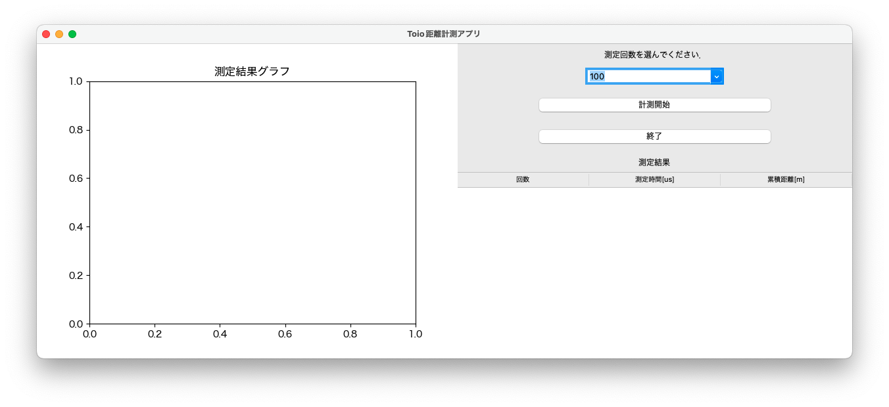
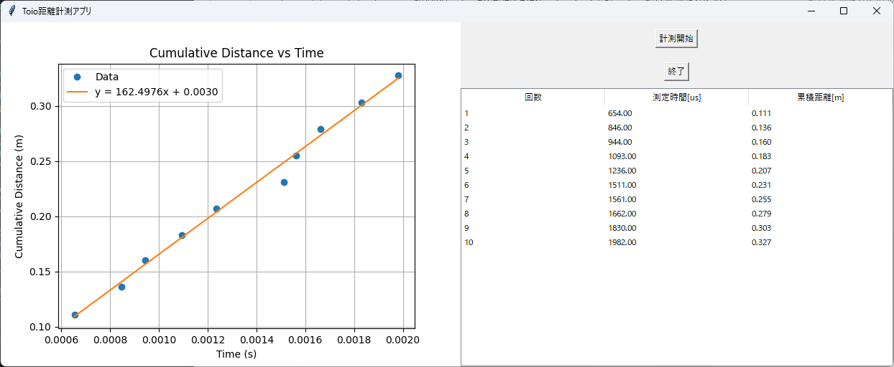
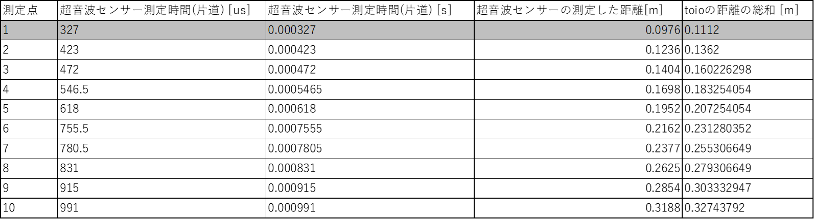
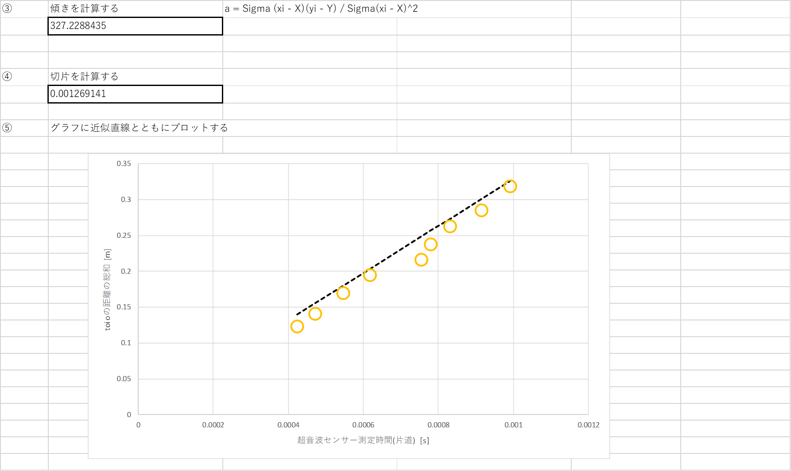
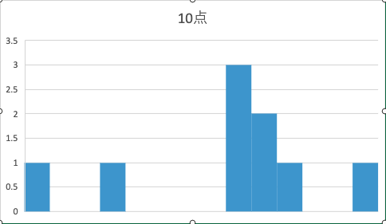
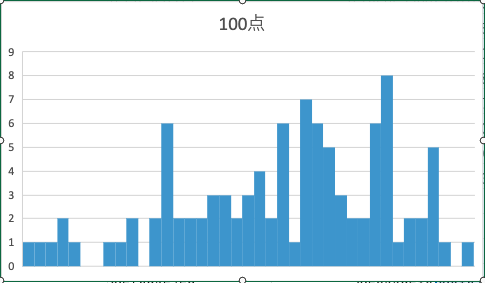

# 超音波センサーによる音速測定プログラム

## 概要
Arduinoスターターキットに付属されている超音波センサーから取得できる値（音波の跳ね返り時間）から音速を計測する．
プログラムにより縦軸に距離、横軸に時間をプロットし、最小二乗法（Excel、matlab, python等利用して）から直線をプロットし近似直線を得る．
直線の傾きが約340m/s（音速）となっているか確認する．


## 内容
- 超音波センサーに接続されるArduinoから、Arduino電源投入直後から一定の間隔でシリアル通信で超音波センサーの音波跳ね返り時間（us）を
PCへ送信する．

- PCではPythonによりプログラミングを行う．
PythonでArduinoから送られるシリアル通信値を受信する．
同時に、toioというロボット・プログラミング教材ロボットをPython経由で制御する．
toioは専用マットにより正確な移動距離を求めることができる．（A3サイズ程度の距離を移動可能）
→PyinstllerというPythonライブラリでexe化可能（たぶん、学生がPythonの実行環境を整える必要なし）

- Pythonで上記、Arduinoからの音波跳ね返り時間（us→sへ変換）とこれに同期して移動したtoioの移動距離(cm→m)を
CSVファイルに保存する．

- このCSVファイルを付属のExcelのように最小自乗法で近似曲線のプロットと傾きを求めることに利用できる．
- また、pythonプログラムでは計測と同時に測定した値から最小自乗法を利用して直接近似直線がプロットされるようにしている．

### 実験スケジュール

- 1回の実験（4限を想定）
- 1, 2限：実験１のチュートリアル的なシリアル通信のプログラムを作成し温度を計測できるところまで行う．
また、3,4限で提示する課題までを概説する．
- 3, 4限：実験２を行い超音波センサーにより音速を最小二乗法の傾きから求める．

## 実験１
### 温度センサーを用いたPCとシリアル通信プログラムの作成

- シリアル通信等の仕様を提示し、それに即したArduinoのプログラムを作成する．
- 基本的にはArduinoのプログラムを提示しておく（プログラムは穴埋め形式、シリアル通信や、温度センサーから取得したデジタル値を温度に変換するところなど）

#### 仕様とプログラム

- シリアル通信受信用のプログラム(python製GUI)
- 未実装．GUIを用いないPythonプログラム

```
import serial
import time

# シリアルポートとボーレートを設定
ser = serial.Serial('COM3', 9600, timeout=1)  # COMポートは適宜変更（例：'COM3'や'/dev/ttyACM0'）

time.sleep(2)  # Arduinoがリセットするのを待つ

try:
    while True:
        if ser.in_waiting > 0:
            line = ser.readline().decode('utf-8').strip()
            print(line)
except KeyboardInterrupt:
    print("終了します。")
finally:
    ser.close()

```

- Arduinoのプログラム

```
#define SENSOR_PIN 0

void setup() {
  Serial.begin(9600);
}

void loop() {

  float temp, volt;
  int value;

  value = analogRead(SENSOR_PIN);

  volt = (float) value * 5.0 / 1023.0;
  temp = volt * 100 - 60;

  Serial.print("Temperature:  ");
  Serial.println( temp );

  
  delay(500);  // 0.5秒ごとに測定
}
```

## 実験2.1
### 超音波センサーとtoioを利用した音速測定プログラム

- シリアル通信等の仕様のみを提示し、それに即したArduinoのプログラムを作成する．
- 仕様に応じてArduino側のプログラムを学生自身が作成する．
- Python製のGUIソフトの配布と、使い方、toioとの連携手順等は別途説明する．
- Arduino側から送信された超音波センサーの音波跳ね返り時間とtoioの累積移動距離がPCにCSVファイル形式で出力される．
学生のPCでExcel(あるいは、matlab?)を利用してCSVデータをインポートし、最小二乗法の実装（傾き、切片の導出）、グラフの作成を行う．

## 実験2.2
### 測定点数による予測残差の度数分布作成

- 最小二乗法で用いる予測残差は、正規分布を仮定している．
- そのため、度数分布を作成することで正規分布の形になっているはずです．
- また、測定点数が多くなることで大数の法則により、正規分布、さらに平均0, 標準偏差1の標準正規分布の形に近づく？

- 上記確認のために、最初に測定した10点のデータをもとに度数分布を作成する．
- さらに、100点計測し、同様の処理をおこなう．
- それぞれに正規分布のプロットを重ねて考察どおりになるか確認する．
- 余力があれば50点測定も行う．


#### 仕様とプログラム

- シリアル通信受信用のプログラム(python製GUI)
- GUI画面例

-- 起動画面

--- 計測ボタンを押す前にコンボボックスで測定回数を選択する．
--- 選択回数に応じて、toioの移動距離、速度を制御．マット（A3タテ）を3枚くらいつなげて測定する．




-- 計測後画面（測定点選択コンボボックスなし）



- Pythonプログラム

```
import serial
import csv
import os
import math
import asyncio
import configparser
from datetime import datetime
import matplotlib.pyplot as plt
import numpy as np
from toio import *
import tkinter as tk
from tkinter import ttk
from matplotlib.backends.backend_tkagg import FigureCanvasTkAgg
import threading

# 初期設定
print("設定ファイル読み込み中...")
dir_path = os.path.dirname(__file__)
config = configparser.ConfigParser()
config.read(os.path.join(dir_path, 'config.ini'), encoding='utf-8')
serial_port = config.get('Serial', 'port')
baudrate = config.getint('Serial', 'baudrate')
csv_file = os.path.join(dir_path, 'distance_log.csv')
print(f"使用シリアルポート: {serial_port}, ボーレート: {baudrate}")

class ToioMeasurementApp:
    def __init__(self, root):
        print("GUI初期化中...")
        self.root = root
        self.root.title("Toio距離計測アプリ")

        self.fig, self.ax = plt.subplots()
        self.canvas = FigureCanvasTkAgg(self.fig, master=self.root)
        self.canvas.get_tk_widget().pack(side=tk.LEFT, fill=tk.BOTH, expand=True)

        control_frame = tk.Frame(self.root)
        control_frame.pack(side=tk.RIGHT, fill=tk.Y)

        self.start_button = tk.Button(control_frame, text="計測開始", command=self.start_measurement)
        self.start_button.pack(pady=10)

        self.quit_button = tk.Button(control_frame, text="終了", command=self.quit_application)
        self.quit_button.pack(pady=10)

        self.tree = ttk.Treeview(control_frame, columns=("#1", "#2", "#3"), show="headings")
        self.tree.heading("#1", text="回数")
        self.tree.heading("#2", text="測定時間[us]")
        self.tree.heading("#3", text="累積距離[m]")
        self.tree.pack(fill=tk.BOTH, expand=True)

        self.ser = serial.Serial(serial_port, baudrate, timeout=2)
        print("シリアルポートをオープンしました")
        self.previous_time = datetime.now()
        self.previous_position = None

    def start_measurement(self):
        print("計測スレッド開始")
        thread = threading.Thread(target=self.run_asyncio_loop)
        thread.start()

    def run_asyncio_loop(self):
        print("非同期ループ開始")
        asyncio.run(self.move_toio_in_steps())

    def quit_application(self):
        print("アプリケーション終了処理開始")
        try:
            if self.ser.is_open:
                print("シリアルポートを閉じます")
                self.ser.close()
        except Exception as e:
            print(f"シリアルポートクローズ時エラー: {e}")
        self.root.quit()

    async def move_toio_in_steps(self):
        print("toioスキャン開始")
        dev_list = await BLEScanner.scan(num=1)
        assert len(dev_list)

        print("toio接続中...")
        cube = ToioCoreCube(dev_list[0].interface)
        await cube.connect()
        print("toio接続完了")

        x_start = 170
        y = 180
        steps = 10
        step_size = 15
        delay_sec = 3

        cumulative_m = 0.0
        distances = []
        times = []

        print("CSVファイル作成中...")
        with open(csv_file, mode='w', newline='', encoding='utf-8') as file:
            writer = csv.writer(file)
            writer.writerow(["Timestamp", "Elapsed_sec", "Ultrasonic_cm", "Toio_moved_mm", "Duration_us", "Distance_m", "Elapsed_s", "Cumulative_m"])

        try:
            for i in range(steps):
                print(f"ステップ {i+1}/{steps}: モーター制御開始")
                if steps < 30:
                    await cube.api.motor.motor_control(10, 10)
                elif steps >= 30:
                    await cube.api.motor.motor_control(30, 30)

                await asyncio.sleep(10/steps)
                # await asyncio.sleep(1)

                await cube.api.motor.motor_control(0, 0)

                print("モーター停止、位置取得中...")
                toiopos = await cube.api.id_information.read()

                x = toiopos.sensor.point.x
                y = toiopos.sensor.point.y
                print(f"現在位置: x={x}, y={y}")

                current_position = (x, y)
                moved_mm = 0.0
                if self.previous_position is not None:
                    dx = current_position[0] - self.previous_position[0]
                    dy = current_position[1] - self.previous_position[1]
                    moved_mm = math.sqrt(dx * dx + dy * dy)
                    print(f"移動距離: {moved_mm:.2f} mm")
                self.previous_position = current_position

                self.ser.reset_input_buffer()
                line = self.ser.readline().decode('utf-8', errors='ignore').strip()
                print(f"シリアル受信: {line}")
                parts = line.split(',')
                if len(parts) < 3:
                    print("データ形式不正、スキップ")
                    continue
                distance, duration, button_state = parts
                try:
                    distance = float(distance)
                    duration = float(duration)
                    button_state = int(button_state)
                except ValueError:
                    print("数値変換失敗、スキップ")
                    continue

                distance_m = distance * 0.01
                duration_s = duration * 0.000001

                if i == 0:
                    cumulative_m = distance_m
                else:
                    cumulative_m += (moved_mm + 5.0) * 0.001

                current_time = datetime.now()
                elapsed_sec = (current_time - self.previous_time).total_seconds()
                self.previous_time = current_time

                with open(csv_file, mode='a', newline='', encoding='utf-8') as file:
                    writer = csv.writer(file)
                    writer.writerow([
                        current_time.strftime("%Y-%m-%d %H:%M:%S"),
                        elapsed_sec,
                        distance,
                        moved_mm + 5.0,
                        duration / 2,
                        distance_m,
                        duration_s,
                        cumulative_m
                    ])

                times.append(duration_s)
                distances.append(cumulative_m)

                self.tree.insert("", "end", values=(i + 1, f"{duration:.2f}", f"{cumulative_m:.3f}"))

                await asyncio.sleep(delay_sec)
        finally:
            print("toio切断とシリアルクローズ")
            await cube.disconnect()
            if self.ser.is_open:
                self.ser.close()

        if len(times) >= 2:
            print("グラフ描画処理開始")
            times_np = np.array(times)
            distances_np = np.array(distances)
            slope, intercept = np.polyfit(times_np, distances_np, 1)
            regression_line = slope * times_np + intercept

            self.ax.clear()
            self.ax.plot(times_np, distances_np, 'o', label='Data')
            self.ax.plot(times_np, regression_line, '-', label=f'y = {slope:.4f}x + {intercept:.4f}')
            self.ax.set_xlabel('Time (s)')
            self.ax.set_ylabel('Cumulative Distance (m)')
            self.ax.set_title('Cumulative Distance vs Time')
            self.ax.legend()
            self.ax.grid(True)
            self.canvas.draw()
            print("グラフ描画完了")

if __name__ == "__main__":
    print("アプリ起動")
    root = tk.Tk()
    app = ToioMeasurementApp(root)
    root.mainloop()

```

- Arduinoのプログラム

```
#define TRIG_PIN 9
#define ECHO_PIN 2
#define BUTTON_PIN 3

void setup() {
  pinMode(TRIG_PIN, OUTPUT);
  pinMode(ECHO_PIN, INPUT);
  pinMode(BUTTON_PIN, INPUT_PULLUP);
  Serial.begin(9600);
}

void loop() {
  // 超音波パルスを送信
  digitalWrite(TRIG_PIN, LOW);
  delayMicroseconds(2);
  digitalWrite(TRIG_PIN, HIGH);
  delayMicroseconds(10);
  digitalWrite(TRIG_PIN, LOW);

  // 跳ね返りの時間を取得（単位：マイクロ秒）
  long duration = pulseIn(ECHO_PIN, HIGH);

  // 距離を算出（cm）
  float distance = duration * 0.034 / 2;
  int buttonState = digitalRead(BUTTON_PIN);
  // 結果を表示
  Serial.print(distance);
  Serial.print(",");
  Serial.print(duration);
  Serial.print(",");
  Serial.println(buttonState);

  delay(500);  // 0.5秒ごとに測定
}
```

- Excelによる最小自乗実装例

-- データ集計表



-- 最小二乗法による直線フィッティングとグラフ作成例



- Excelによる残差の度数分布

-- 10点計測



-- 100点計測

