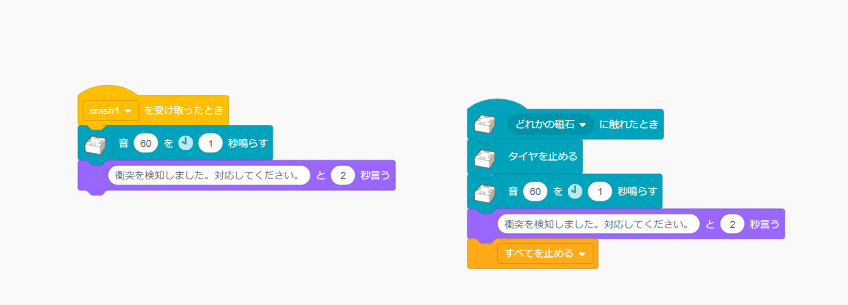
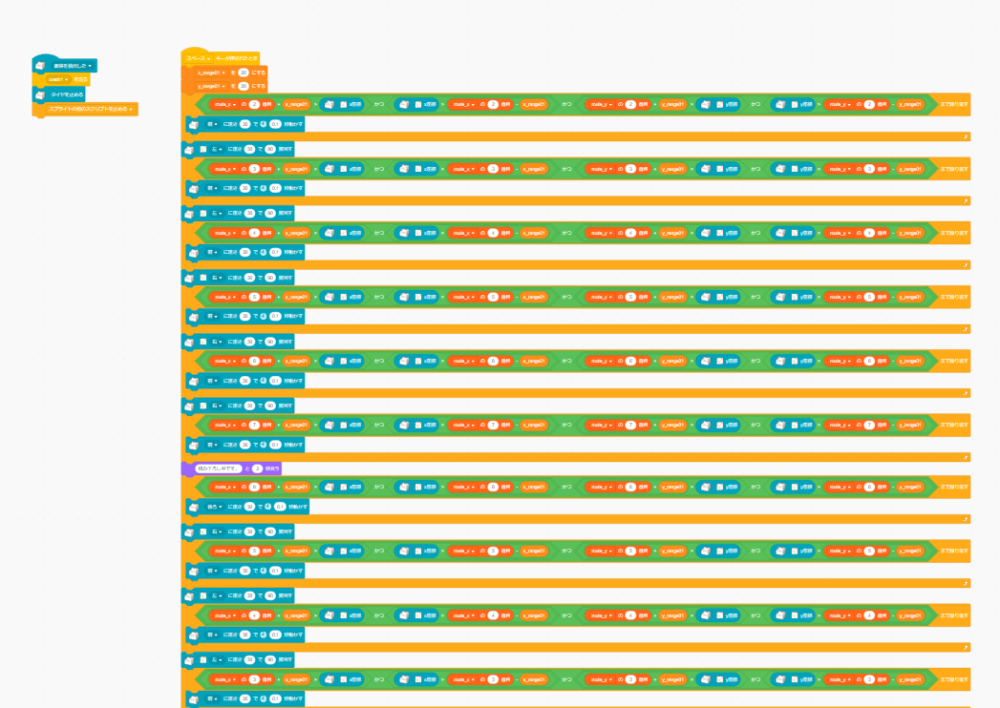

# 【ロボット】簡易版自動運搬システム．
## 概要
- COMPASS5.0 ロボット分野で作成された教材をもとに、簡易的に上流工程から実装までを体験できる教材を目指す．
- テーマは、倉庫内の物資運搬の自動システムの構築である．
- ロボットはtoioを利用し、運搬における機構部分の製作はLEGOブロックをもちいて簡易的に作らせる．（アクチュエータ等は基本的に作らせない．）
- メインは上流工程の体験、からの実装やその後の保守業務を一気通貫で体験できること．

## 上流工程
- 見積もり仕様書（要件定義書）を作成する．
- 学生自身が顧客要望からどこまでの機能を実装するか計画をたてる．
- 保守的な要因（プロダクトライフサイクル、MTTR）やタイムマネジメント、プロジェクトマネジメントを仕様書等ドキュメントベースで管理させ、都度振り返りをさせる．

## 実装
- toioとヴィジュアルプログラミングを用いてシステムを構築させる．
- テストケースはこちらから提示し、多少ランダム要素を持たせて、機能が実現できているかの確認
- 保守ケースも口頭ベースで確認する．

### プログラム例
ひとつのソースファイルで作成する．

- GUI制御用のスクリプト（スプライト）

- toioコントロール用スクリプト（スプライト）

# テスト・保守
- 上流工程のドキュメントから振り返り的にシミュレーションさせる．